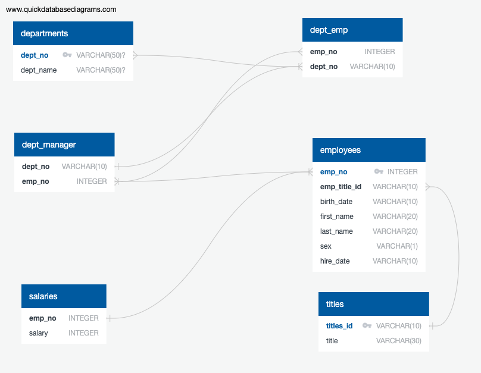

# SQL Homework - Employee Database: A Mystery in Two Parts

## Background

It is a beautiful spring day, and it is two weeks since you have been hired as a new data engineer at Pewlett Hackard. Your first major task is a research project on employees of the corporation from the 1980s and 1990s. All that remain of the database of employees from that period are six CSV files.

In this assignment, you will design the tables to hold data in the CSVs, import the CSVs into a SQL database, and answer questions about the data. In other words, you will perform:

1. Data Engineering

3. Data Analysis

## Instructions

#### Data Modeling

Inspect the CSVs and sketch out an ERD of the tables.

#### Data Engineering

* Use the information you have to create a table schema for each of the six CSV files. Remember to specify data types, primary keys, foreign keys, and other constraints.

  * For the primary keys check to see if the column is unique, otherwise create a [composite key](https://en.wikipedia.org/wiki/Compound_key). Which takes to primary keys in order to uniquely identify a row.
  * Be sure to create tables in the correct order to handle foreign keys.

* Import each CSV file into the corresponding SQL table. **Note** be sure to import the data in the same order that the tables were created and account for the headers when importing to avoid errors.

-- Exported from QuickDBD
-- Drop tables if they exist
DROP TABLE IF EXISTS departments;
DROP TABLE IF EXISTS dept_emp;
DROP TABLE IF EXISTS dept_manager;
DROP TABLE IF EXISTS employees;
DROP TABLE IF EXISTS salaries;
DROP TABLE IF EXISTS titles;

-- Create tables
-- Import .csv files
CREATE TABLE "departments" (
    "dept_no" VARCHAR(50)   NULL,
    "dept_name" VARCHAR(50)   NULL,
    CONSTRAINT "pk_departments" PRIMARY KEY (
        "dept_no"
     )
);

CREATE TABLE "dept_emp" (
    "emp_no" INTEGER   NOT NULL,
    "dept_no" VARCHAR(10)   NOT NULL
);

CREATE TABLE "dept_manager" (
    "dept_no" VARCHAR(10)   NOT NULL,
    "emp_no" INTEGER   NOT NULL
);

CREATE TABLE "employees" (
    "emp_no" INTEGER   NOT NULL,
    "emp_title_id" VARCHAR(10)   NOT NULL,
    "birth_date" VARCHAR(10)   NOT NULL,
    "first_name" VARCHAR(20)   NOT NULL,
    "last_name" VARCHAR(20)   NOT NULL,
    "sex" VARCHAR(1)   NOT NULL,
    "hire_date" VARCHAR(10)   NOT NULL,
    CONSTRAINT "pk_employees" PRIMARY KEY (
        "emp_no"
     )
);

CREATE TABLE "salaries" (
    "emp_no" INTEGER   NOT NULL,
    "salary" INTEGER   NOT NULL
);

CREATE TABLE "titles" (
    "titles_id" VARCHAR(10)   NOT NULL,
    "title" VARCHAR(30)   NOT NULL,
    CONSTRAINT "pk_titles" PRIMARY KEY (
        "titles_id"
     )
);

ALTER TABLE "departments" ADD CONSTRAINT "fk_departments_dept_no" FOREIGN KEY("dept_no")
REFERENCES "dept_emp" ("dept_no");

ALTER TABLE "dept_emp" ADD CONSTRAINT "fk_dept_emp_emp_no_dept_no" FOREIGN KEY("emp_no", "dept_no")
REFERENCES "dept_manager" ("emp_no", "dept_no");

ALTER TABLE "dept_manager" ADD CONSTRAINT "fk_dept_manager_emp_no" FOREIGN KEY("emp_no")
REFERENCES "employees" ("emp_no");

ALTER TABLE "employees" ADD CONSTRAINT "fk_employees_emp_no" FOREIGN KEY("emp_no")
REFERENCES "salaries" ("emp_no");

ALTER TABLE "employees" ADD CONSTRAINT "fk_employees_emp_title_id" FOREIGN KEY("emp_title_id")
REFERENCES "titles" ("titles_id");

-- Query * FROM each table to confirm data
SELECT * FROM departments;
SELECT * FROM dept_emp;
SELECT * FROM dept_manager;
SELECT * FROM employees;
SELECT * FROM salaries;
SELECT * FROM titles;

#### Data Analysis

Once you have a complete database, do the following:

1. List the following details of each employee: employee number, last name, first name, sex, and salary.

SELECT employees.emp_no, employees.last_name, employees.first_name, employees.sex, salaries.salary
FROM employees
JOIN salaries
ON employees.emp_no = salaries.emp_no;

2. List first name, last name, and hire date for employees who were hired in 1986.

SELECT first_name, last_name, hire_date 
FROM employees
WHERE hire_date BETWEEN '1/1/1986' AND '12/31/1986'
ORDER BY hire_date;

3. List the manager of each department with the following information: department number, department name, the manager's employee number, last name, first name.

SELECT departments.dept_no, departments.dept_name, dept_manager.emp_no, employees.last_name, employees.first_name
FROM departments
JOIN dept_manager
ON departments.dept_no = dept_manager.dept_no
JOIN employees
ON dept_manager.emp_no = employees.emp_no;

4. List the department of each employee with the following information: employee number, last name, first name, and department name.

SELECT dept_emp.emp_no, employees.last_name, employees.first_name, departments.dept_name
FROM dept_emp
JOIN employees
ON dept_emp.emp_no = employees.emp_no
JOIN departments
ON dept_emp.dept_no = departments.dept_no;

5. List first name, last name, and sex for employees whose first name is "Hercules" and last names begin with "B."

SELECT employees.first_name, employees.last_name, employees.sex
FROM employees
WHERE first_name = 'Hercules'
AND last_name Like 'B%'

6. List all employees in the Sales department, including their employee number, last name, first name, and department name.

SELECT departments.dept_name, employees.last_name, employees.first_name
FROM dept_emp
JOIN employees
ON dept_emp.emp_no = employees.emp_no
JOIN departments
ON dept_emp.dept_no = departments.dept_no
WHERE departments.dept_name = 'Sales';

7. List all employees in the Sales and Development departments, including their employee number, last name, first name, and department name.

FROM dept_emp
JOIN employees
ON dept_emp.emp_no = employees.emp_no
JOIN departments
ON dept_emp.dept_no = departments.dept_no
WHERE departments.dept_name = 'Sales' 
OR departments.dept_name = 'Development';

8. In descending order, list the frequency count of employee last names, i.e., how many employees share each last name.

SELECT last_name,
COUNT(last_name) AS "frequency"
FROM employees
GROUP BY last_name
ORDER BY
COUNT(last_name) DESC;